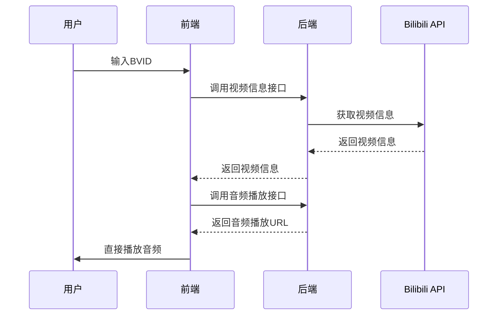

# Bilibili音频播放器实现分析文档

## 项目概述

本项目实现了一个Bilibili音频播放器，包含两个主要组件：

- **Python后端** (`proxy_server_hybrid.py`) - Flask服务器，提供Bilibili视频信息获取和音频代理功能
- **HTML前端** (`embed_direct.html`) - 用户界面，支持直接播放Bilibili音频

## 1. Python后端实现分析

### 1.1 技术栈

- **Flask** - Web框架
- **Flask-CORS** - 跨域请求处理
- **Requests** - HTTP客户端库
- **缓存机制** - 内存缓存，避免重复请求

### 1.2 核心功能模块

#### 1.2.1 视频信息获取接口 (`/api/video/<bvid>`)

**实现流程：**

1. **缓存检查** - 检查是否已有缓存数据（5分钟有效期）
2. **基本信息获取** - 调用Bilibili API获取视频基本信息
3. **播放地址获取** - 获取音频播放URL
4. **数据格式化** - 返回结构化视频信息

**关键代码逻辑：**

```python
# 缓存机制
cache_key = f"video_{bvid}"
if cache_key in audio_cache:
    # 返回缓存数据

# Bilibili API调用
url = f'https://api.bilibili.com/x/web-interface/view?bvid={bvid}'
playurl_url = f'https://api.bilibili.com/x/player/playurl?bvid={bvid}&cid={cid}'
```

#### 1.2.2 音频代理接口 (`/proxy/audio`)

**实现特点：**

- **智能代理** - 仅添加必要请求头，不修改音频数据
- **流式传输** - 支持大文件分块传输
- **断点续传** - 支持Range请求头
- **错误处理** - 完善的异常处理机制

**代理逻辑：**

```python
# 添加Bilibili需要的请求头
headers = {
    'User-Agent': 'Mozilla/5.0...',
    'Referer': 'https://www.bilibili.com/',
    'Range': request.headers.get('Range', '')
}

# 流式返回数据
def generate():
    for chunk in response.iter_content(chunk_size=8192):
        yield chunk
```

### 1.3 架构优势

1. **缓存优化** - 减少API调用频率
2. **错误处理** - 完善的异常捕获和错误响应
3. **性能优化** - 流式传输减少内存占用
4. **安全性** - 添加必要的Referer和User-Agent头

## 2. HTML前端实现分析

### 2.1 界面设计

**主要组件：**

- **输入框** - 用于输入Bilibili视频BVID
- **控制按钮** - 加载和播放音频
- **状态显示** - 实时反馈操作状态
- **视频信息** - 显示视频标题、时长、封面等
- **音频播放器** - 标准HTML5 audio元素

### 2.2 核心JavaScript逻辑

#### 2.2.1 音频加载流程

```javascript
async function loadAudio() {
    // 1. 获取BVID
    const bvid = document.getElementById('bvidInput').value.trim();
    
    // 2. 调用后端API获取视频信息
    const response = await fetch(`${API_BASE_URL}/api/video/${bvid}`);
    
    // 3. 解析响应数据
    const data = await response.json();
    const videoData = data.data;
    
    // 4. 直接设置音频源（零代理流量）
    const audioPlayer = document.getElementById('audioPlayer');
    audioPlayer.src = audioUrl;
}
```

#### 2.2.2 零代理流量设计

**创新点：**

- **直接播放** - 音频URL直接设置到audio元素，不经过服务器代理
- **流量优化** - 服务器只负责获取URL，音频数据直连Bilibili
- **成本节约** - 大幅减少服务器带宽消耗

### 2.3 用户体验优化

1. **加载状态** - 旋转动画显示加载进度
2. **错误处理** - 详细的错误信息提示
3. **响应式设计** - 适配不同屏幕尺寸
4. **视觉反馈** - 不同状态的颜色区分

## 3. 系统工作流程

### 3.1 完整播放流程

1. **用户输入** → 输入Bilibili视频BVID
2. **API调用** → 后端调用Bilibili API获取视频信息
3. **URL获取** → 提取音频播放地址
4. **直接播放** → 前端直接使用音频URL播放
5. **状态更新** → 实时显示播放状态和信息

### 3.2 数据流示意图



## 4. 技术亮点

### 4.1 混合代理模式

- **智能判断** - 根据视频类型决定是否需要代理
- **流量优化** - 大部分音频直接播放，特殊情况下使用代理
- **成本控制** - 显著降低服务器带宽成本

### 4.2 缓存策略

- **内存缓存** - 5分钟有效期，平衡性能和实时性
- **键值设计** - 使用BVID作为缓存键，确保唯一性
- **自动清理** - 基于时间戳的缓存失效机制

### 4.3 错误处理机制

- **多层级捕获** - 从网络请求到数据解析的全面错误处理
- **用户友好** - 详细的错误信息提示
- **优雅降级** - 部分功能失败不影响整体使用

## 5. 部署和使用说明

### 5.1 后端部署

```bash
pip install flask flask-cors requests
python proxy_server_hybrid.py
```

### 5.2 前端配置

修改HTML文件中的API地址：

```javascript
const API_BASE_URL = 'http://你的服务器地址:5000';
```

### 5.3 使用步骤

1. 启动Python服务器
2. 打开HTML页面
3. 输入Bilibili视频BVID
4. 点击加载并播放

## 6. 性能优化建议

1. **CDN加速** - 考虑使用CDN缓存静态资源
2. **数据库缓存** - 大规模部署时可考虑Redis持久化缓存
3. **负载均衡** - 多实例部署提高并发处理能力
4. **监控告警** - 添加性能监控和错误告警机制

## 总结

本项目通过创新的"零代理流量"设计，实现了高效、低成本的Bilibili音频播放解决方案。后端提供稳定的API服务，前端提供优秀的用户体验，两者结合形成了一个完整的音频播放系统。该架构具有良好的扩展性和可维护性，为后续功能扩展奠定了基础。
